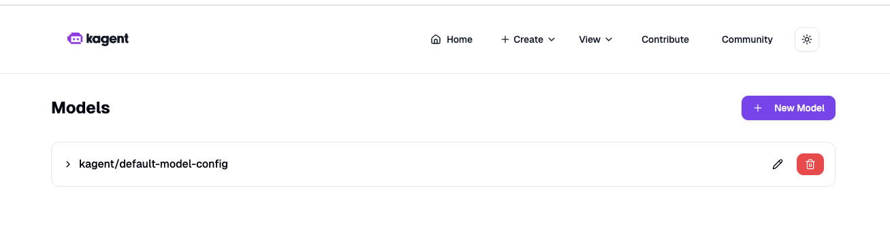

# Step 1: Install Kagent with minimal configuration

Install Kagent via Helm with all agents disabled. This keeps footprint small while enabling you to explore CRDs and ModelConfigs.

```bash
# Install CRDs via OCI chart (creates namespace if needed)
helm install kagent-crds oci://ghcr.io/kagent-dev/kagent/helm/kagent-crds \
  --namespace kagent \
  --create-namespace

# Install kagent with minimal values from support-code
helm upgrade kagent oci://ghcr.io/kagent-dev/kagent/helm/kagent \
  --namespace kagent \
  -f /Users/admin/Documents/kodekloud/kagent/kagent-lab/020-040/support-code/values-min.yaml \
  --set providers.default=openAI \
  --set providers.openAI.apiKey=$OPENAI_API_KEY
```

To access UI of Kagent we have to port-forward

```bash
kubectl port-forward svc/kagent-ui 8080:8080 -n kagent
```

Validation (to be performed):


```bash
# Deployment status
kubectl get deployments -n kagent
kubectl get pods -n kagent 

# CRDs present (ModelConfig should be installed)
kubectl get crds | grep -i modelconfig || echo "ModelConfig CRD not found"
```

UI Validation questions for students

1. number of models available


2. Same in cli validation
```bash
k get modelconfigs -n kagent

output

NAME                   PROVIDER   MODEL
default-model-config   OpenAI     gpt-4.1-mini
```


Reference:
- Values reference: https://kagent.dev/docs/kagent/resources/helm

