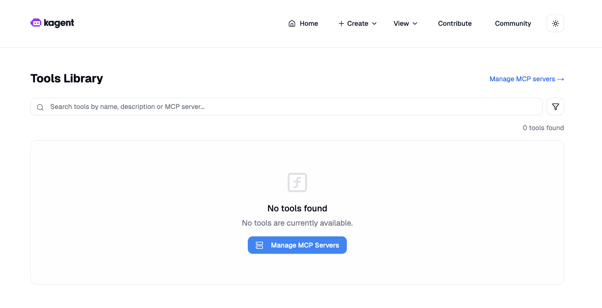
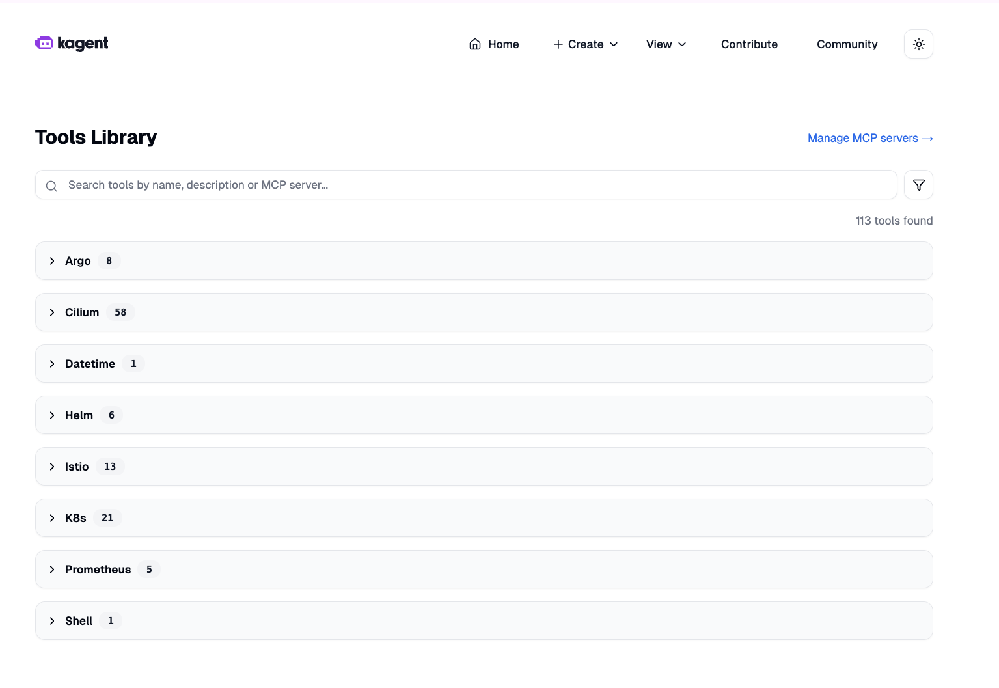

# Step 3: Enable built-in tools

Enable Kagent built-in tools (grafana-mcp, querydoc) to explore how tools appear in the UI and can be consumed by agents later.

Questions
- In the UI, how many tools are visible now?

answer should be 0


```bash
# Apply values to enable built-in tools
helm upgrade kagent oci://ghcr.io/kagent-dev/kagent/helm/kagent \
  --namespace kagent \
  -f /Users/admin/Documents/kodekloud/kagent/kagent-lab/020-040/support-code/03-values-enable-tools.yaml \
  --set providers.default=openAI \
  --set providers.openAI.apiKey=$OPENAI_API_KEY  
```

Validation (to be performed):

```bash
# 1) kagent-tools deployment present
kubectl get deploy -n kagent | grep kagent-tools

kagent-tools        1/1     1            1           9m10s

# 2) Pods running
kubectl get pods -n kagent

kagent-controller-5778f95587-xzsnw   1/1     Running   0          41m
kagent-tools-6d6695c5-6d8jk          1/1     Running   0          9m21s
kagent-ui-6c56d787f6-tw8nv           1/1     Running   0          41m

```

Questions
- In the UI, how many tools are visible now? 8


- In the UI, how many agents do you see now ? 0


Optional inspections:
```bash
# View controller logs for tool initialization
kubectl logs -n kagent deploy/kagent-controller --tail=200 | grep -i tool || true
```
