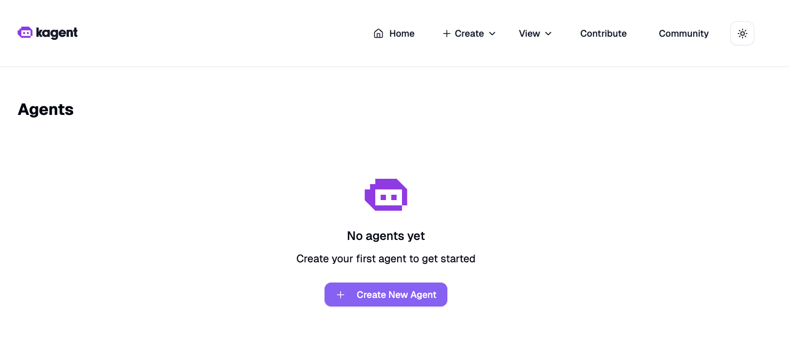
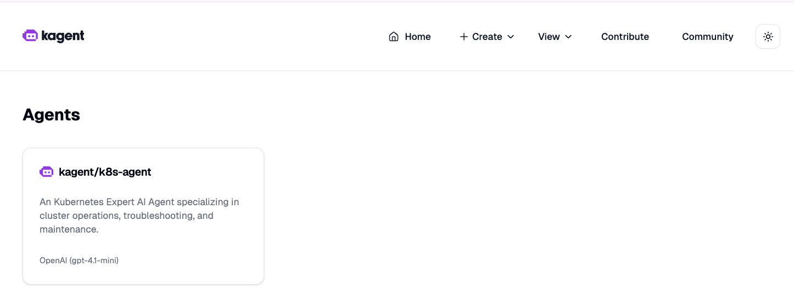
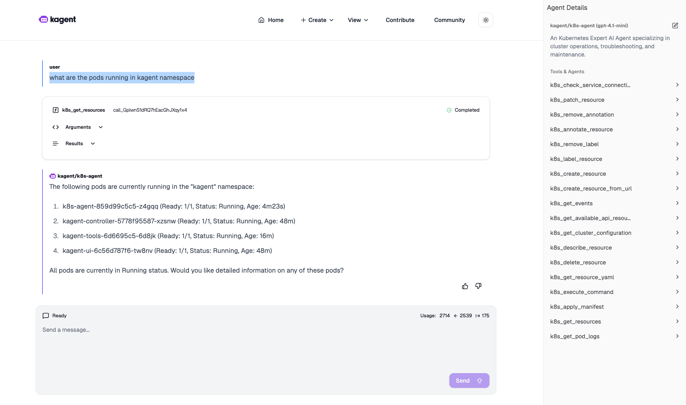

# Step 4: Enable k8s-agent

Enable the `k8s-agent` to see how agents appear in the UI and how they can later use tools and ModelConfigs.

- In the UI, how many agents do you see now ? 0



```bash
# Enable only the k8s-agent
helm upgrade kagent oci://ghcr.io/kagent-dev/kagent/helm/kagent \
  --namespace kagent \
  -f /Users/admin/Documents/kodekloud/kagent/kagent-lab/020-040/support-code/04-values-enable-agents.yaml \
  --set providers.default=openAI \
  --set providers.openAI.apiKey=$OPENAI_API_KEY
```

Validation (to be performed):

```bash
# 1) Pods status
kubectl get pods -n kagent

# 2) Agents list
kubectl get agents -n kagent || true
```

Questions
- In the UI home page, how many agents do you see? - 1


- Select the `k8s-agent` and check its details. What model config is it using?

- run agent query, "what are the pods running in kagent namespace"


Optional inspections:
```bash
# Describe the k8s-agent CR
# kubectl describe agent k8s-agent -n kagent

# View the raw YAML
# kubectl get agent k8s-agent -n kagent -o yaml
```
