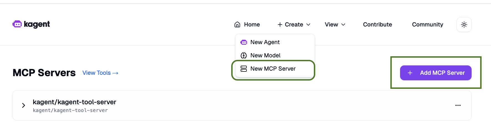
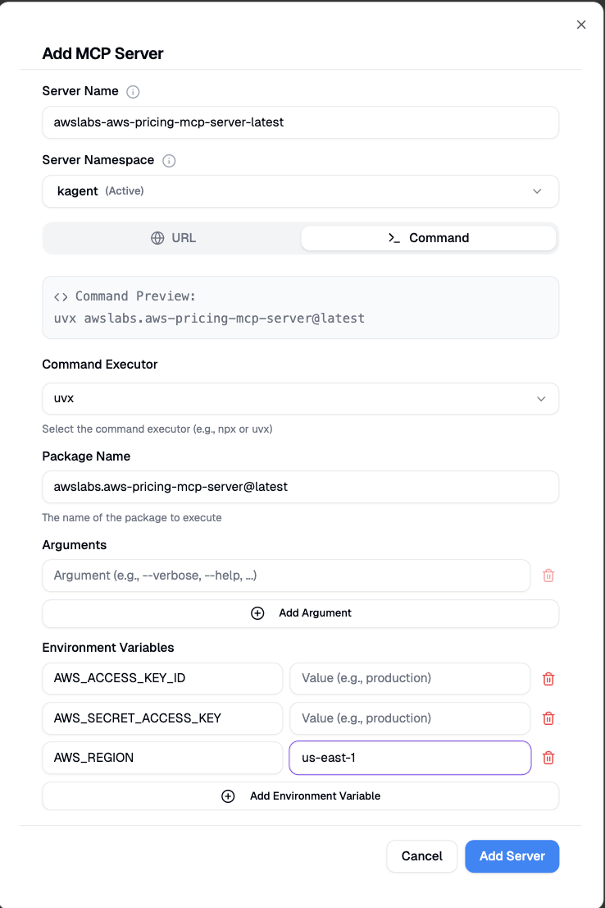

# lab engineer nnote: We would need aws credntials for this, permission in the mcp documents

# Step 1: Indtall AWS MCP Server From UI

* Steps to follow
    create - > mcp server -> Add MCP Server
    

* fill the form
    * server name: aws-pricing-mcp-server
    * namespace : kagent
    * select command
    * command executor -> uv
    * package name -> awslabs.aws-pricing-mcp-server@latest 
    * environment variables -> AWS_ACCESS_KEY_ID, AWS_SECRET_ACCESS_KEY, AWS_REGION
    
    * click on add server

# Lab Validation 

* pod like "awslabs-aws-pricing-mcp-server-latest-65d979fcf7-x6xbh" is running in kagent namespace