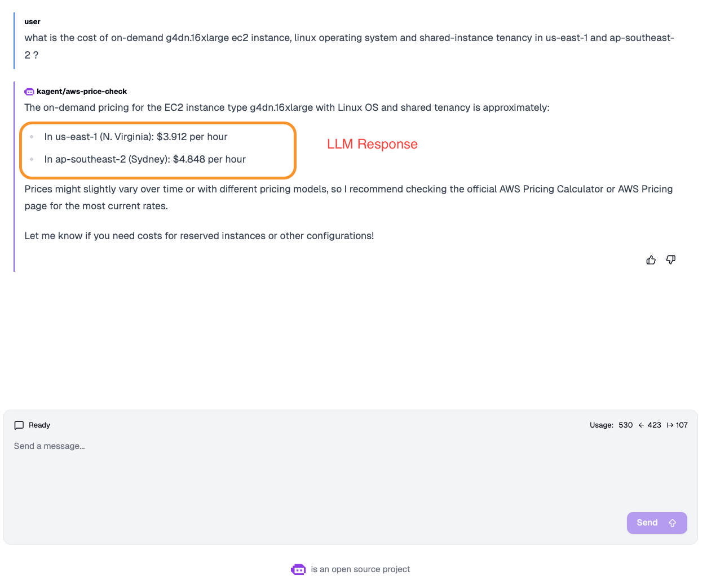

# step 1: Deploy price checker agent

kubectl apply -f /Users/admin/Documents/kodekloud/kagent/kagent-lab/030-070/support-code/no_tool_aws-price-checker.yaml

# step 2: validate the agent

ensure pod like "aws-price-check-759558d984-62npw" is running

# step 3: Query the agent with below question

Prompt query as below:

"what is the cost of on-demand g4dn.16xlarge ec2 instance, linux operating system and shared-instance tenancy in us-east-1 and ap-southeast-2 ?"

Answer 

NOTE for sutdents: Please remember to take screenshot of the LLM response