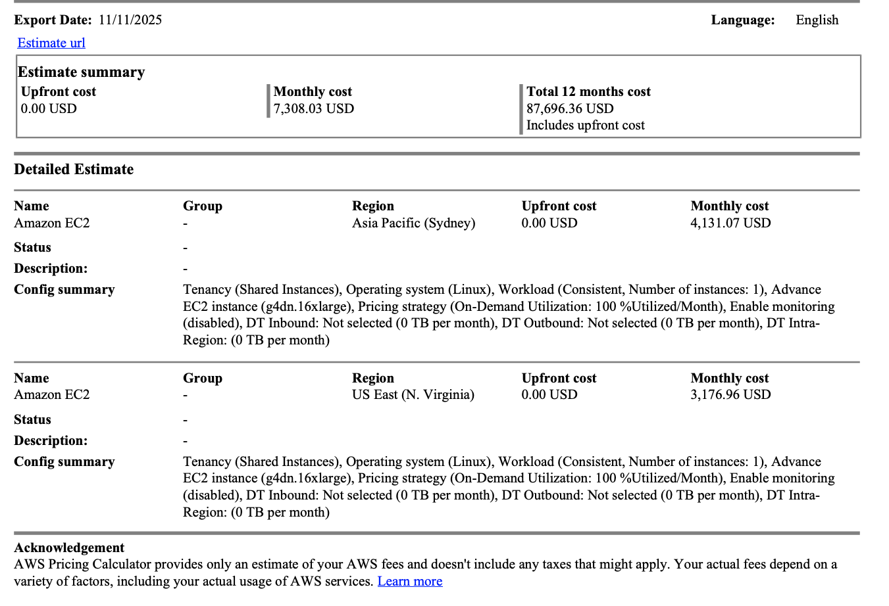

# step 0: Find the list of tools available in the pricing mcp server

login to kagent dashboard and find the list of tools available in the pricing mcp server. Below is the expected answer. 

- get_pricing_service_codes
- get_pricing_service_attributes
- get_pricing_attribute_values
- get_pricing
- get_price_list_urls
- generate_cost_report

# step2: Update agent with tools

Following section to be added to  /Users/admin/Documents/kodekloud/kagent/kagent-lab/030-070/support-code/with_tool_aws-price-checker.yaml

    tools:
    - mcpServer:
        apiGroup: kagent.dev
        kind: MCPServer
        name: awslabs-aws-pricing-mcp-server-latest
        toolNames:
        - get_pricing_service_codes
        - get_pricing_service_attributes
        - get_pricing_attribute_values
        - get_pricing
        - get_price_list_urls
        - generate_cost_report
      type: McpServer
  description: aws price checker api
  type: Declarative

# step 1: Deploy price checker agent

kubectl apply -f /Users/admin/Documents/kodekloud/kagent/kagent-lab/030-070/support-code/with_tool_aws-price-checker.yaml

# step 2: validate the agent

ensure pod like "aws-price-check-759558d984-62npw" is running

# step 3: Query the agent with below question

Prompt query as below:

"what is the cost of on-demand g4dn.16xlarge ec2 instance, linux operating system and shared-instance tenancy in us-east-1 and ap-southeast-2 ?"

# step 4: Post a complex query

"Compare the on-demand and 1-year reserved instance pricing for m7g.large, m7g.xlarge, and m7g.2xlarge EC2 instances across the ap-southeast-2 (Sydney) and us-east-1 (N. Virginia) regions. Include details like vCPU, memory, and hourly cost for Linux. Then estimate the monthly cost for running a 3-tier web app (2 web servers, 2 app servers, 1 db server) 24×7 in each region — and highlight which region offers the best cost-to-performance ratio. End with 3 cost-optimization recommendations aligned with the AWS Well-Architected Framework."

