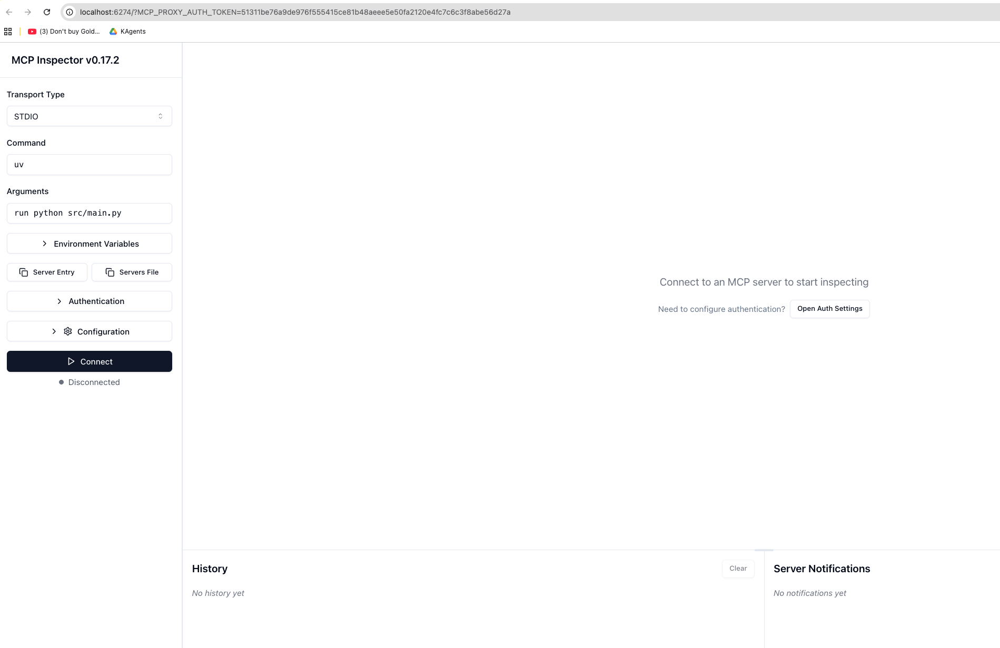
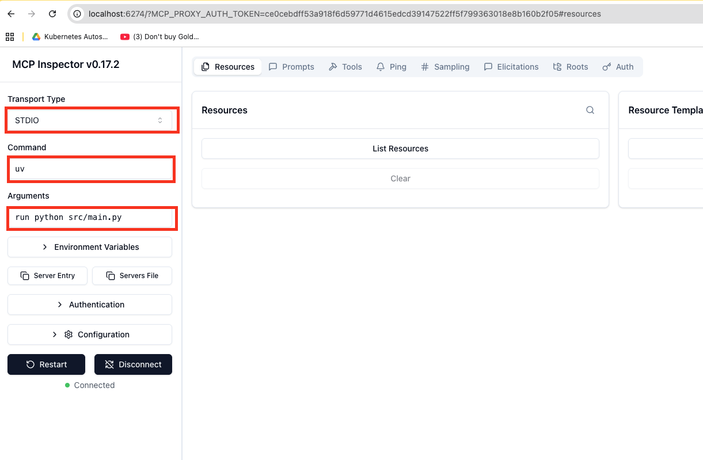
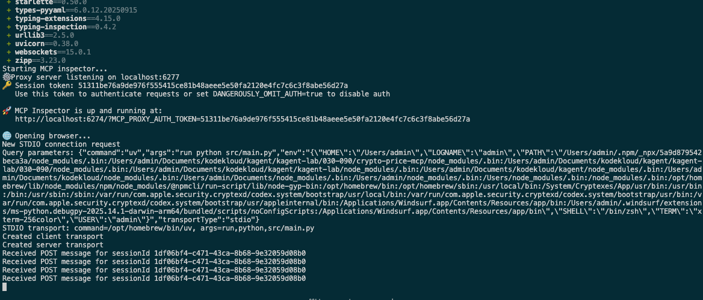

# Step 3: Local MCP Server Development

In this step, we'll create a local MCP server from scratch using the `kmcp` CLI tool.

## 1. Create the MCP Project

Create a scaffold for your FastMCP server project:

```bash
# Create a new project
kmcp init python my-mcp-server
```

Follow the interactive CLI prompts to add description and author for your project.

## 2. Review Project Structure

Examine the created project structure:

```bash
find my-mcp-server
```

You should see:
```
├── src/
|   ├── core/           # MCP server code and utilities
│   ├── tools/          # Tool implementations
│   └── main.py         # MCP server entry point
├── tests/              # Built-in test suite
├── Dockerfile          # For K8s deployment
├── kmcp.yaml          # MCP container definition
├── pyproject.toml      # Python dependencies
├── .env.example        # Environment variables
└── README.md          # Documentation
```

## 3. Add Tools

In an MCP server, tools are functions that provide specific capabilities to AI agents. Each tool has a defined interface with input/output specifications, allowing AI agents to invoke them programmatically to perform tasks like fetching data, making calculations, or interacting with external services.

Create a boilerplate for an MCP tool in the src/tools directory:

```bash
# Add a new tool
kmcp add-tool kodekloudtool --project-dir my-mcp-server


#output
 kmcp add-tool kodekloudtool --project-dir my-mcp-server
✅ Successfully created tool: kodekloudtool
📁 Generated file: src/tools/kodekloudtool.py
🔄 Updated tools/__init__.py with new tool import

Next steps:
1. Edit src/tools/kodekloudtool.py to implement your tool logic
2. Configure any required environment variables in kmcp.yaml
3. Run 'uv run python src/main.py' to start the server
4. Run 'uv run pytest tests/' to test your tool


# Review the tool code
cat my-mcp-server/src/tools/kodekloudtool.py
```

The boilerplate includes code similar to the `echo` tool that was automatically created during initialization. Use this as a base for your own tools.

## 3: Use the Inspector

The MCP Inspector is a web-based development tool that allows you to interact with and test your MCP server's tools in real-time. It provides a graphical interface to discover available tools, execute them with different parameters, and view their responses, making it essential for debugging and development.

Next we will start the mcp server and connect to it using the MCP inspector tool.


## 4. Run Locally

Start your MCP server locally:

```bash
# Run the server
kmcp run --project-dir my-mcp-server
```

```output
 + typing-extensions==4.15.0
 + typing-inspection==0.4.2
 + urllib3==2.5.0
 + uvicorn==0.38.0
 + websockets==15.0.1
 + zipp==3.23.0
npm warn exec The following package was not found and will be installed: @modelcontextprotocol/inspector@0.17.2
npm warn deprecated node-domexception@1.0.0: Use your platform's native DOMException instead
Starting MCP inspector...
⚙️ Proxy server listening on localhost:6277
🔑 Session token: 1617735291cba498c464fb0b290137c2a6f7adda9ab0981f97ea8d524e68eee9
   Use this token to authenticate requests or set DANGEROUSLY_OMIT_AUTH=true to disable auth

🚀 MCP Inspector is up and running at:
   http://localhost:6274/?MCP_PROXY_AUTH_TOKEN=1617735291cba498c464fb0b290137c2a6f7adda9ab0981f97ea8d524e68eee9

🌐 Opening browser...
```


You'll see output with a Proxy Session Token - save this for the inspector!


## 5. Use the Inspector

NOTE: On kodekloud we have to expose it has we URL. 

Connect to your server using the MCP Inspector tool:

1. Select "STDIO" from Transport Type dropdown
2. In Command section, ensure we have "uv" 
3. In Arguments section, enter "run python src/main.py"
4. In Configuration section, enter your Proxy Session Token
5. Click Connect


Note: Wait a few seconds for the connection to establish. If it fails, verify your settings and token.

## 6. Test Your Tool

1. Go to the Tools tab
2. Click "List Tools"
3. Select the "mytool" tool
4. Enter a test message
5. Click "Run Tool"
6. Verify your message is echoed in the result


