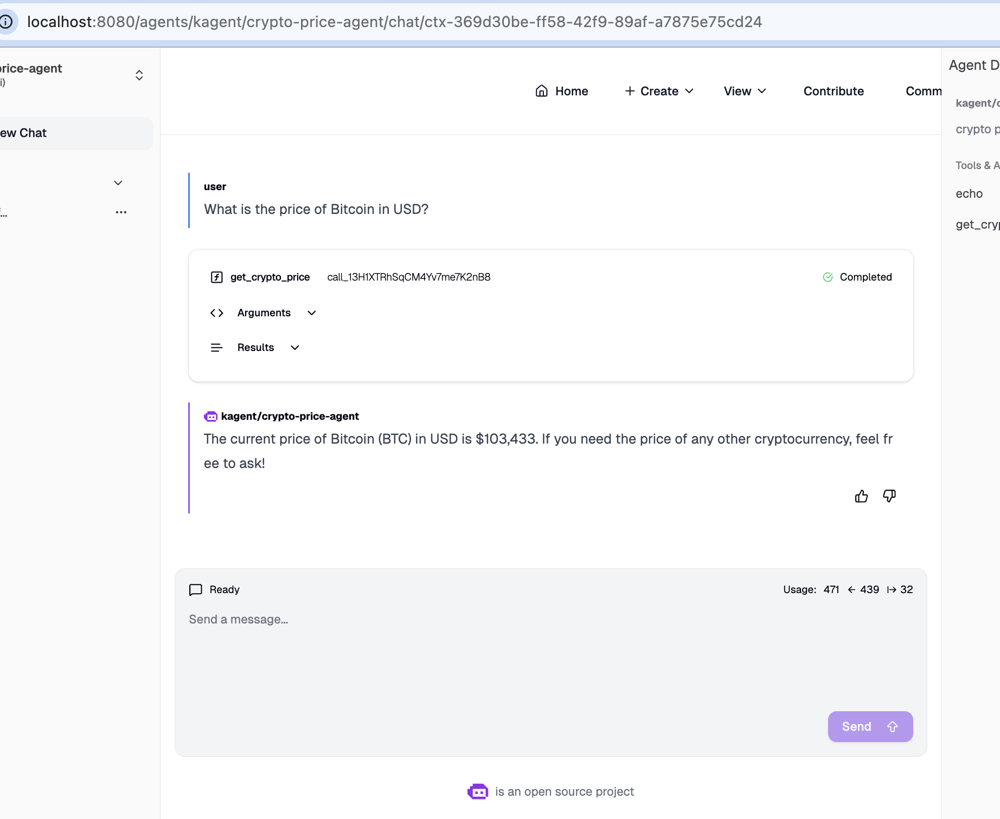

# Step 10: Deploy and Test Crypto Price Agent

## Overview

This is the moment you've been working toward! You'll create an AI agent that uses your custom MCP server to answer cryptocurrency price questions in natural language.

## Understanding the Agent Resource

K-Agent uses a custom Kubernetes resource called `Agent`. This resource defines:
- **Agent type**: Declarative (rule-based) or BYO (bring your own)
- **Model configuration**: Which LLM to use
- **System message**: Agent's personality and instructions
- **Tools**: Which MCP servers and tools the agent can use

## Review the Agent Manifest

Let's examine the provided agent configuration:

```bash
cat support-code/crypto-price-agent.yaml
```

### Manifest Breakdown

```yaml
apiVersion: kagent.dev/v1alpha2
kind: Agent
metadata:
  name: crypto-price-agent
  namespace: kagent
spec:
  declarative:
    modelConfig: openai-modelconfig
    stream: true
    systemMessage: |-
      You're a helpful agent, made by the kagent team.

      # Instructions
          - If user question is unclear, ask for clarification before running any tools
          - Always be helpful and friendly
          - If you don't know how to answer the question DO NOT make things up, tell the user "Sorry, I don't know how to answer that" and ask them to clarify the question further
          - If you are unable to help, or something goes wrong, refer the user to https://kagent.dev for more information or support.

      # Response format:
          - ALWAYS format your response as Markdown
          - Your response will include a summary of actions you took and an explanation of the result
          - If you created any artifacts such as files or resources, you will include those in your response as well
    tools:
    - mcpServer:
        apiGroup: kagent.dev
        kind: MCPServer
        name: my-mcp-server
        toolNames:
        - echo
        - get_crypto_price
      type: McpServer
  description: crypto price agent
  type: Declarative
```

### Key Sections Explained

#### 1. Agent Metadata

```yaml
metadata:
  name: crypto-price-agent
  namespace: kagent
```

- **name**: How you'll reference this agent
- **namespace**: Must match K-Agent installation

#### 2. Agent Type

```yaml
spec:
  type: Declarative
  declarative:
    # ... configuration ...
```

- **Declarative**: Uses K-Agent's built-in agent framework
- Alternative: **BYO** (Bring Your Own) for custom agent implementations

#### 3. Model Configuration

```yaml
    modelConfig: openai-modelconfig
    stream: true
```

- **modelConfig**: References a ModelConfig resource (defines which LLM to use)
- **stream**: Enables streaming responses for better UX

#### 4. System Message

```yaml
    systemMessage: |-
      You're a helpful agent, made by the kagent team.
      
      # Instructions
          - If user question is unclear, ask for clarification...
          - Always be helpful and friendly...
```

This is the agent's "personality" and instructions. It tells the agent:
- How to behave
- When to use tools
- How to format responses
- What to do when uncertain

**Pro Tip**: Well-crafted system messages dramatically improve agent performance!

#### 5. Tool Configuration

```yaml
    tools:
    - mcpServer:
        apiGroup: kagent.dev
        kind: MCPServer
        name: crypto-price-mcp
        toolNames:
        - echo
        - get_crypto_price
      type: McpServer
```

This connects the agent to your MCP server:
- **name**: References the MCPServer resource (`my-mcp-server`)
- **toolNames**: Specific tools the agent can use
- **type**: McpServer (vs. other tool types)

## Deploy the Agent

Apply the agent manifest:

```bash
kubectl apply -f support-code/crypto-price-agent.yaml
```

### Expected Output

```
agent.kagent.dev/crypto-price-agent created
```

## Verify Agent Deployment

Check that the agent was created:

```bash
kubectl get agent -n kagent
```

### Expected Output

```
NAME                         TYPE          READY   ACCEPTED
cloudwatch-log-analyzer-v1   Declarative   True    True
echo-agent                   Declarative   True    True
langgraph-agent              BYO           True    True
crypto-price-agent           Declarative   True    True
```

Your `crypto-price-agent` should show:
- **READY: True** - Agent is configured correctly
- **ACCEPTED: True** - Configuration was validated

### View Agent Details

```bash
kubectl describe agent crypto-price-agent -n kagent
```

Look for:
- **Status**: Should be Ready
- **Tools**: Should list `echo` and `get_crypto_price`
- **Model Config**: Should reference `openai-modelconfig`

## Access the K-Agent UI

Now it's time to test your agent!

### Get the K-Agent UI URL

```bash
kubectl get svc -n kagent kagent-ui
```

If using port-forward:

```bash
kubectl port-forward -n kagent svc/kagent-ui 8080:80
```

Then access: `http://localhost:8080`

### Login to K-Agent UI

1. Open your browser to the K-Agent UI
2. You should see the agent dashboard

## Test Your Agent

### Select the Crypto Price Agent

1. In the UI, find the agent selector
2. Choose **crypto-price-agent** from the dropdown
3. You should see the agent is ready to chat

### Test Query 1: Simple Bitcoin Price

**Ask**: "What is the price of Bitcoin in USD?"

**Expected Response**:
```
I'll check the current Bitcoin price for you.

*[Agent calls get_crypto_price tool]*

The current price of Bitcoin is $43,250.50 USD.
```


### Test Query 2: Different Cryptocurrency

**Ask**: "How much is Ethereum worth?"

**Expected Response**:
```
Let me fetch the current Ethereum price.

*[Agent calls get_crypto_price tool]*

Ethereum is currently trading at $2,280.75 USD.
```


### Test Query 5: Invalid Cryptocurrency

**Ask**: "What's the price of FakeCoin?"

**Expected Response**:
```
I tried to fetch the price for FakeCoin, but it appears this cryptocurrency is not available in the price database. 

Could you verify the cryptocurrency name? I can help you check prices for popular cryptocurrencies like Bitcoin, Ethereum, Cardano, Solana, and many others.
```

## Understanding What Happened

When you asked about Bitcoin price:

1. **User query** → K-Agent UI
2. **Agent received** the natural language question
3. **Agent analyzed** and determined it needs price data
4. **Agent called** `get_crypto_price` tool via MCP protocol
5. **MCP server** fetched data from CoinGecko API
6. **Tool returned** price data
7. **Agent formatted** the response in natural language
8. **UI displayed** the answer

All of this happened in seconds!

## Behind the Scenes: Tool Selection

The agent uses the LLM to:
1. **Understand intent**: "User wants cryptocurrency price"
2. **Review available tools**: Sees `get_crypto_price` in tool list
3. **Read tool description**: Understands what the tool does
4. **Determine parameters**: Extracts "bitcoin" and "usd" from query
5. **Call tool**: Executes with correct parameters
6. **Interpret results**: Understands the returned data
7. **Generate response**: Creates natural language answer

This is the power of AI agents with custom tools!

## Experiment Further

Try these advanced queries:

- "What cryptocurrencies can you check prices for?"
- "Is Bitcoin more expensive than Ethereum?"
- "Track Bitcoin price" (agent should explain it can only fetch current price)
- "What was Bitcoin's price yesterday?" (agent should explain limitations)


## Summary

Congratulations! You've successfully:
- ✅ Built a custom MCP server from scratch
- ✅ Implemented a real-world tool with external API integration
- ✅ Tested locally using MCP Inspector
- ✅ Containerized and deployed to Kubernetes
- ✅ Created an AI agent that uses your custom tool
- ✅ Tested end-to-end with natural language queries

**Key Takeaways**:
- ✅ Custom tools extend agent capabilities
- ✅ MCP provides a standard protocol for tool integration
- ✅ Agents intelligently select and use tools based on context
- ✅ The same pattern applies to any API or service
- ✅ K-Agent makes deployment and management seamless

## What You've Learned

### Technical Skills
- MCP server development workflow
- Python tool implementation
- Docker containerization
- Kubernetes deployment
- Agent configuration

### Concepts
- Model Context Protocol (MCP)
- AI agent tool use
- Declarative agent configuration
- System message engineering
- Tool selection and execution

## Real-World Applications

You can now build tools for:
- **DevOps**: Kubernetes cluster management, CI/CD status
- **Monitoring**: Metrics queries, alert management
- **Business**: CRM lookups, inventory checks
- **Finance**: Stock prices, transaction history
- **Support**: Ticket systems, knowledge bases

## Next Steps

To continue learning:

1. **Add more tools**: Create tools for other APIs
2. **Enhance error handling**: Add retry logic, caching
3. **Add authentication**: Secure your tools with API keys
4. **Create tool chains**: Build tools that work together
5. **Monitor usage**: Track tool calls and performance

## Resources

- **K-Agent Documentation**: https://kagent.dev
- **MCP Specification**: https://modelcontextprotocol.io
- **CoinGecko API**: https://www.coingecko.com/en/api
- **FastMCP Framework**: https://github.com/jlowin/fastmcp

---

## Lab Complete! 🎉

You've mastered the complete lifecycle of custom MCP server development and deployment. You're now ready to build AI agents with custom capabilities tailored to your specific needs.

**What's your next tool going to be?**
