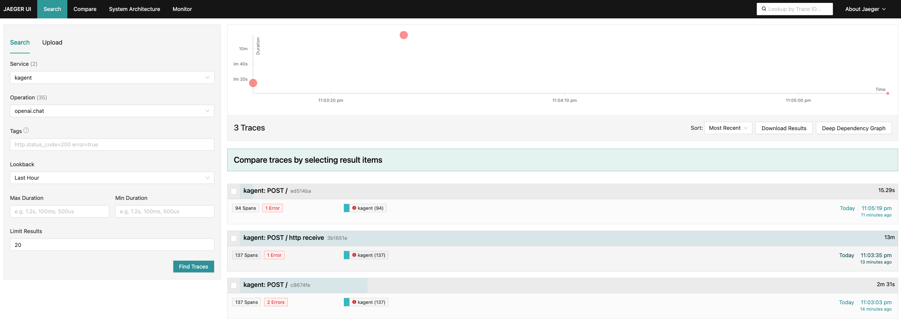

# Step 6: Access Jaeger UI and Analyze Traces

## Overview
Access the Jaeger UI to view and analyze the traces generated by the k8s-agent interactions from the previous step.

## Port Forward to Jaeger UI

Set up port forwarding to access the Jaeger query interface:

```bash
# Port forward to Jaeger UI
kubectl port-forward svc/jaeger-query -n jaeger 16686:16686
```

Keep this terminal session open while using the Jaeger UI.

## Access Jaeger UI

Open your web browser and navigate to:
```
http://localhost:16686
```

You should see the Jaeger UI homepage with the search interface.

## Navigate to Trace Search

1. **Service Dropdown**: In the Jaeger Search menu, locate the Service dropdown
2. **Select kagent Service**: Choose `kagent` from the list of available services
3. **Operation Filter**: In the Operation dropdown, select `openai.chat` to filter for traces specific to the k8s-agent
4. **Time Range**: Adjust the time range if needed (default is usually the last hour)

## Search for Traces

1. **Click "Find Traces"** to execute the search
2. **Review Results**: You should see a list of traces corresponding to your agent interactions



## Analyze Trace Details

Click on individual traces to examine detailed information:


### Understanding the openai.chat Trace

When you click on an `openai.chat` trace, you'll see a detailed breakdown of the AI agent's interaction with OpenAI. Pay special attention to the following elements:

#### Key Trace Components

1. **Main openai.chat Span**: The root span showing the overall duration of the OpenAI API call
2. **Function Call Spans**: Look for spans with names like `llm.request.functions.8.name` which represent:
   - Individual function calls made by the AI agent
   - Tool invocations during the conversation
   - Kubernetes API operations triggered by the agent

#### What to Look For

**Function Call Analysis:**
- **`llm.request.functions.X.name`**: Each numbered function represents a specific tool or API call
- **Duration**: How long each function call took to execute
- **Tags**: Metadata showing function parameters and results
- **Status**: Success or failure indicators for each function

**Example Function Calls:**
- `gen_ai.prompt.0.content` :  Full prompt that was passed to OpenAI
- `llm.request.functions.1.name`: Might be a Kubernetes API call to list pods
- `llm.request.functions.2.name`: Could be a namespace query
- `llm.request.functions.3.name`: Possibly a service discovery operation

#### Trace Navigation Tips

1. **Expand Spans**: Click on individual spans to see detailed timing and metadata
2. **Check Tags**: Look at the tags section for function names, parameters, and return values
3. **Monitor Duration**: Identify which function calls are taking the longest time
4. **Error Detection**: Red-colored spans indicate errors or exceptions in function execution

This trace visualization helps you understand exactly how the AI agent processes requests and interacts with Kubernetes APIs.
