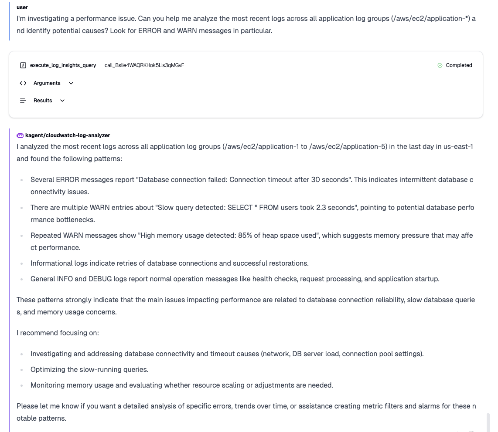

# Step 2: Query CloudWatch Log Groups

## Objective
Test the CloudWatch AI agent's capabilities by executing various log analysis queries and demonstrating intelligent log monitoring functionality.

## Prerequisites
- CloudWatch AI agent (`cloudwatch-log-analyzer`) is deployed and running
- CloudWatch log groups are created with sample data
- Agent is accessible via Kagent UI

## Step-by-Step Testing

### 1. Access Agent Chat Interface

1. **Navigate to Agent Chat**
   - Open Kagent UI at `http://localhost:8080`
   - Go to **"Agents"** section
   - Click on `cloudwatch-log-analyzer` agent
   - Select **"Chat"** or **"Test"** tab

### 2. Basic Log Group Discovery

**Query 1: List Available Log Groups**
```
Can you show me all the CloudWatch log groups available in the us-east-1 region?
```

**Expected Response:**
The agent should list all 15 log groups (10 test functions + 5 applications) and provide a summary.

### 3. Log Group Analysis

**Query 2: Analyze Specific Log Group**
```
Please analyze the log group "/aws/ec2/application-1" and show me the recent log entries. What patterns do you see?
```

**Expected Response:**
- List of recent log events
- Pattern analysis (INFO, ERROR, WARN messages)
- Summary of log activity


### 4. Log Filtering and Search

**Query 3: Filter by Keywords**
```
Find all log entries containing "database" or "connection" in the /aws/ec2/application-2 log group from the past 7 days. Are there any connection issues?
```

**Expected Response:**
- Filtered log entries matching keywords
- Analysis of database connectivity patterns
- Recommendations if issues are found

### 5. Performance Monitoring

**Query 4: Memory Usage Analysis**
```
Look for memory-related warnings in all application log groups. Create a summary report of memory usage patterns.
```

**Expected Response:**
- Memory warning events
- Trends and patterns
- Performance recommendations

### 6. Log Stream Investigation

**Query 5: Detailed Stream Analysis**
```
Show me the log streams for /aws/lambda/test-function-1 and /aws/ec2/application-1. Compare their activity levels and tell me which one has recent data.
```

**Expected Response:**
- List of log streams
- Activity status
- Timestamp analysis

### 7. Advanced Query with Insights

**Query 6: Complex Analysis**
```
Perform a comprehensive analysis of all application log groups. Create a health report that includes:
1. Error rate summary
2. Most active log groups
3. Any anomalies or patterns of concern
4. Recommendations for monitoring improvements
```

**Expected Response:**
- Comprehensive health report
- Statistical analysis
- Actionable recommendations
- Monitoring suggestions

### 8. Metric Filter Creation

**Query 7: Create Monitoring Metrics**
```
Based on the error patterns you found, suggest and create a metric filter for monitoring database connection errors in the application log groups.
```

**Expected Response:**
- Metric filter configuration
- Explanation of the filter logic
- Monitoring recommendations

### 9. Troubleshooting Scenario

**Query 8: Incident Investigation**
```
I'm investigating a performance issue. Can you help me analyze the most recent logs across all application log groups (/aws/ec2/application-*) and identify potential causes? Look for ERROR and WARN messages in particular.
```

**Expected Response:**
- Time-based log analysis
- Correlation of events
- Root cause analysis
- Troubleshooting steps

### 10. Alternative Query Approaches (If Time-Based Queries Fail)

**Query 9a: Direct Log Stream Access**
```
First, show me the log streams in /aws/ec2/application-1, then get the log events from the most recent stream. Don't use time filters - just get the raw log data.
```


**Query 9b: Flexible Error Search**
```
For the log group /aws/ec2/application-1, use get_log_events to retrieve all available log entries from any log streams, then filter them for ERROR messages. Ignore time constraints and just show me what's actually in the logs.
```

**Query 9c: Step-by-Step Analysis**
```
Please do this step by step:
1. List all log streams in /aws/ec2/application-1
2. Get log events from the first available stream
3. Show me what types of log messages are present
4. Then search for ERROR patterns in that data
```

