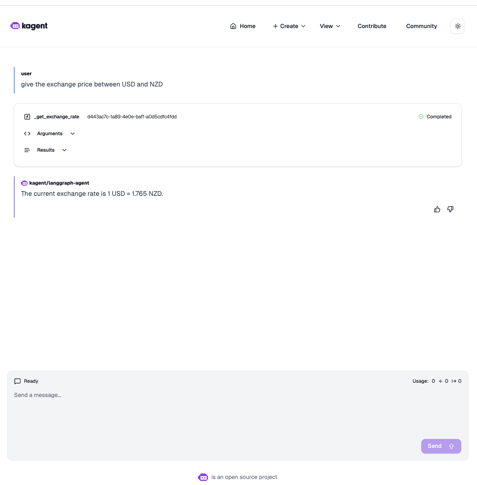

# Step 4: Test the Currency Exchange Agent

## Overview
Test your deployed BYO LangGraph agent using both the A2A protocol API and the Kagent UI.

## Instructions

### 1. Port Forward the Kagent Controller

Open a new terminal and run:

```bash
kubectl port-forward svc/kagent-controller 8083:8083 -n kagent
```

**Expected Output:**
```
Forwarding from 127.0.0.1:8083 -> 8083
Forwarding from [::1]:8083 -> 8083
```

**Keep this terminal open** - the port forward must remain active for the following steps.

### 2. Test the A2A Protocol Endpoint

In a new terminal, query the agent's metadata:

```bash
curl localhost:8083/api/a2a/kagent/langgraph-agent/.well-known/agent.json | jq
```

**Expected Output:**
```json
{
  "name": "langgraph_agent",
  "description": "This is LangGraph currency agent.",
  "url": "http://127.0.0.1:8083/api/a2a/kagent/langgraph-agent/",
  "version": "",
  "capabilities": {
    "streaming": true,
    "pushNotifications": false,
    "stateTransitionHistory": true
  },
  "defaultInputModes": [
    "text"
  ],
  "defaultOutputModes": [
    "text"
  ],
  "skills": []
}
```

This confirms the agent is accessible via the A2A protocol.

### 3. Access the Kagent UI

Port forward the UI service (in another terminal):

```bash
kubectl port-forward svc/kagent-controller 8080:8080 -n kagent
```

Open your browser and navigate to:
```
http://localhost:8080
```

### 4. Query the Agent via UI

1. In the Kagent UI, navigate to the **Agents** section
2. Find and click on **langgraph-agent**
3. In the chat interface, enter a query:

**Query Examples:**

```
Give me the exchange rate between USD and NZD
```

```
What is the current exchange rate from EUR to GBP?
```

```
Convert 100 USD to JPY
```

**Expected Response:**

The agent should provide current exchange rate information, for example:

```
The current exchange rate from USD to NZD is approximately 1.65 NZD per 1 USD.
This means:
- 1 USD = 1.65 NZD
- 100 USD = 165 NZD
```


### 5. Test Multiple Queries

Try various currency pairs to verify the agent works correctly:

- **USD to EUR**: "What's the USD to EUR exchange rate?"
- **GBP to USD**: "Convert 50 GBP to USD"
- **JPY to USD**: "How much is 10000 JPY in USD?"
- **AUD to CAD**: "Exchange rate from AUD to CAD?"

## Understanding the A2A Protocol

The **A2A (Agent-to-Agent) Protocol** is a standard for agent communication that allows:

- **Discovery**: Agents expose metadata about their capabilities
- **Invocation**: Agents can be called programmatically
- **Streaming**: Support for streaming responses
- **Interoperability**: Different agent frameworks can communicate

### A2A Endpoints

```
/.well-known/agent.json    - Agent metadata
/invoke                    - Invoke the agent
/stream                    - Stream agent responses
```

## Validation Questions

### Q1: What type of agent did you deploy?
- A) Declarative agent
- B) BYO (Bring Your Own) agent
- C) MCP agent
- D) Tool agent

**Answer**: B) BYO (Bring Your Own) agent

### Q2: What protocol does the BYO agent use to communicate with Kagent?
- A) HTTP REST API
- B) gRPC
- C) A2A (Agent-to-Agent) protocol
- D) WebSocket

**Answer**: C) A2A (Agent-to-Agent) protocol

### Q3: Where is the Google API key stored?
- A) Hardcoded in the Docker image
- B) In a ConfigMap named `kagent-config`
- C) In a Kubernetes secret named `kagent-google`
- D) In an environment variable file

**Answer**: C) In a Kubernetes secret named `kagent-google` in the `kagent` namespace

### Q4: What is the main advantage of BYO agents over declarative agents?
- A) Easier to configure
- B) Better performance
- C) Full control over agent logic and behavior
- D) Automatic scaling

**Answer**: C) Full control over agent logic and behavior


## Key Takeaways

✅ **BYO agents** give you full control over agent logic  
✅ **A2A protocol** enables standardized agent communication  
✅ **Kubernetes secrets** securely manage API credentials  
✅ **Multi-platform images** ensure compatibility across architectures  
✅ **LangGraph** provides a powerful framework for building custom agents  

